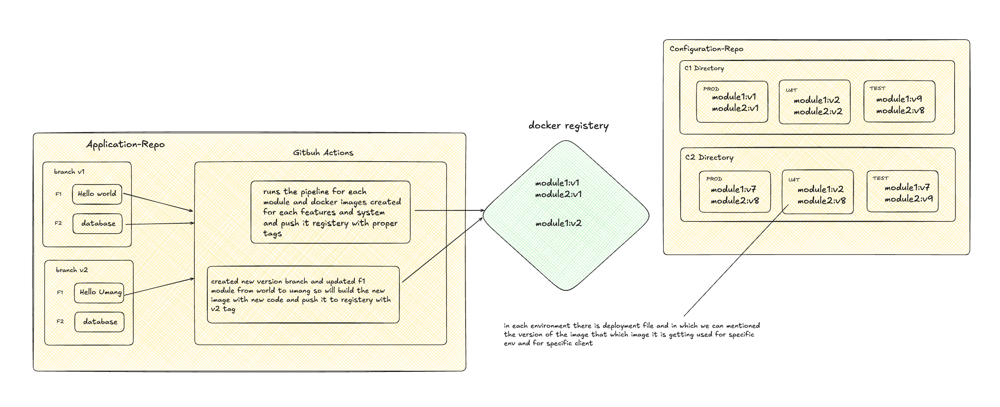
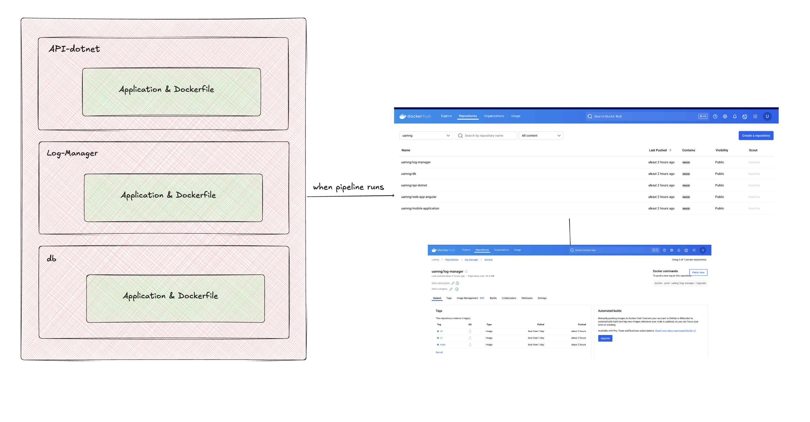

# **Branching Strategy for CI/CD**

This repository follows a structured branching strategy to manage multiple clients, versions, and environments efficiently.

---

## **Branching Structure & Repos**

## Question - 1 - How can you manage the CICD for each type of system for each client with a different version in each environment? 

### Managing CI/CD for Each System, Client, and Version
Since each client can use different versions across environments, managing everything in a single repository becomes complex. To handle this efficiently, we use two repositories with a sequential pipeline approach:

Test-Repo (Application Code & Versioning)

Contains the actual application code for different systems (F1, F2, F3) and features (Register, Login, Logout).
Uses version-based branches (V1, V2, V3...VN) to maintain different versions.
CI pipeline builds Docker images for each system or feature and pushes them to a container registry with proper version tags.
Test-Configuration (Client-Specific Deployments)

Manages client-specific configurations.
Each client (C1, C2, C3...) has a dedicated directory.
Inside each client directory, environment-specific subdirectories (TEST, UAT, PROD) are maintained.
These environments pull the required Docker images from Test-Repo and deploy the appropriate version based on client requirements.

Yes, this structure makes it easy to manage deployments for each client, environment, and module. By maintaining separate repositories for the application code and configurations:

- **Application-Repo**: Builds and pushes versioned Docker images for each module.

- **Configuration-Repo**: Defines client-specific environments and selects the appropriate image versions for deployment.

This approach ensures flexibility, easy version control, and seamless updates—just by changing the image version in the deployment files.

---

## Question - 2 - Design the GitHub branch structure and CI/CD process so that you can manage all the pipeline easily 

- In the test repository, we manage the application and build Docker images for each module. We follow a version-based branching strategy, where the branch name determines the image tag. Whenever there's an update in a specific version branch, the pipeline runs and updates the corresponding image.

## Question - 3 - Use variables for configuration as and when possible, instead of hard coding it 

### Configuration and Deployment Strategy

### Overview
This repository follows a **fully variable-based and dynamic** configuration for managing deployments across multiple clients and environments.

### Configuration Repository
- Uses **variables for each environment and client**, ensuring flexible and scalable deployments.
- Designed to be **more dynamic and secure** once the exact use case and best practices are defined.
- **Client-specific deployment**: Updates to one client’s configuration do not affect others.  
  - Example: If a variable or image is updated for **C1 in TEST**, only **TEST for C1** is deployed, leaving other environments and clients untouched.

### CI/CD Pipeline Strategy
- The **Test repository** manages application code and follows a **Continuous Integration** model.
- **Images are dynamically tagged** based on branch names and built per module.
- **Deployment is managed separately** in the configuration repository, ensuring that updates do not immediately impact running deployments.
- New versions can be deployed **incrementally**:
  - First to **TEST/UAT** environments.
  - After validation, they are moved to **PROD**.

### Key Benefits
- **Decoupled architecture**: Ensures that **application updates do not disrupt existing deployments**.
- **Controlled release process**: Changes can be tested in lower environments before deploying to production.
- **Scalability**: Supports multiple clients and environments with minimal manual intervention.

This setup provides **full control over deployments**, allowing seamless updates while maintaining stability.

- In the configuration repository, clients can use any version of the application for any environment. They can also choose specific image versions for different modules. For example, Client C1 in PROD might use v1 for the .NET module and v4 for the database module.

